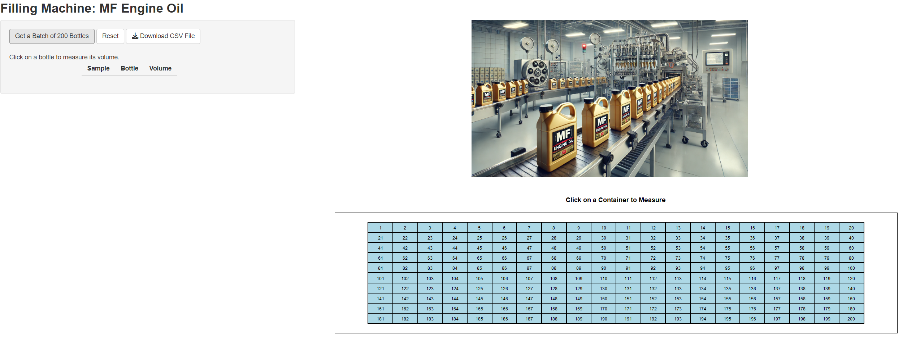

# Filling-Machine
**Goal**: Simulating a filling machine for educational purposes.

This is an interactive Shiny app that simulates a **Engine Oil Filling Machine** and allows users to measure the volume of randomly selected bottles.

## Features:
✅ Click to measure bottle volumes  
✅ Interactive data table with export option  
✅ Custom UI with CSS styling  

### Instruction:

Run `shiny::runGitHub('Filling-Machine', 'm-fili')`

### Demo:

